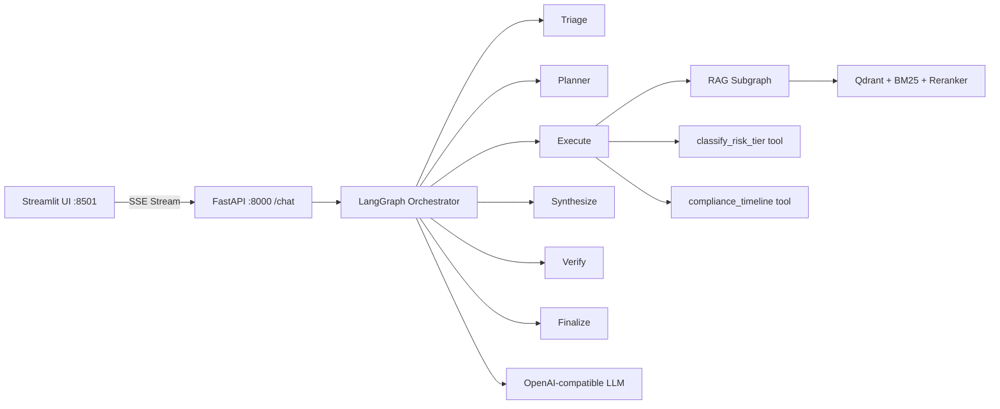

# EU AI Act Copilot

An agentic RAG assistant for first-pass EU AI Act compliance work. It answers
questions with article-level citations, routes risk classification and deadline
work to deterministic tools, and streams the agent trace through FastAPI and
Streamlit.

This is decision support, not legal advice. A human must verify the cited
regulation and apply organisation-specific facts before relying on an output.

---

## 1. Problem Statement & Motivation

### Why is this problem relevant?
Regulation (EU) 2024/1689 (the EU AI Act) entered into force in 2024, introducing a comprehensive, risk-based regulatory framework for artificial intelligence across the European Union. Non-compliance carries severe administrative fines—up to €35,000,000 or 7% of worldwide annual turnover. The regulation is legally complex: 113 articles, 180 recitals, and 13 annexes with staggered, multi-year application deadlines (from 6 months to 36 months).

### What user need does it satisfy?
AI developers, compliance officers, deployers, and legal teams need fast, reliable first-pass compliance triage without sifting through hundreds of pages of legal text. They need to know:
1. Whether their AI system falls under **prohibited practices** (Art. 5) or **high-risk classification** (Annex III / Art. 6).
2. Exactly **which articles** and requirements apply to their role (provider vs. deployer).
3. The exact **statutory compliance deadlines** based on system category.

### Why is an Agentic RAG approach advantageous?
Static RAG (simple retrieve-and-generate) and raw LLM prompting fail on regulatory texts:
- **Hallucination & Citation Drift:** Raw LLMs often cite non-existent articles or blend different directives.
- **Multi-step Reasoning:** Assessing risk and deadlines requires decomposing composite questions into dependent subtasks (e.g. "Is it an AI system?" $\to$ "Does it fall under Annex III?" $\to$ "Does the Art. 6(3) carve-out apply?").
- **Deterministic Guardrails:** Regulatory date arithmetic (Art. 113) and Annex III rule trees must be exact and auditable. An agentic workflow delegates these to deterministic Python tools rather than relying on stochastic LLM arithmetic.
- **Verification & Self-Correction:** The LangGraph orchestrator verifies citations against retrieved chunks before finalizing, retrying retrieval if claims lack grounding.

---

## 2. Architecture & Design Decisions



### LangGraph Agentic Workflow (6 Nodes)
The orchestrator implements autonomous decision-making, sub-task planning, and stateful execution:
1. **`triage`**: Conditionally routes incoming queries:
   - Out-of-scope / harmful $\to$ immediate `refuse` (bypassing generation).
   - Single-hop factual queries $\to$ direct execution (`direct`).
   - Complex / composite queries $\to$ `planner`.
2. **`planner`**: Decomposes composite regulatory questions into ordered, dependent `SubTask` structures.
3. **`execute`**: Autonomously invokes tools across steps:
   - **`rag_search`**: Modular RAG retrieval.
   - **`classify_risk_tier`**: Deterministic rule engine for Annex III & Art. 6(3) high-risk classification.
   - **`compliance_timeline`**: Deterministic calculator for Art. 113 staggered implementation dates.
4. **`synthesize`**: Synthesizes intermediate subtask outputs into an integrated legal response with article citations.
5. **`verify`**: Checks that all citations match ingested chunks and that answers adhere to safety guardrails. Conditionally routes back to `execute` for at most one retrieval retry if evidence is lacking.
6. **`finalize`**: Formats the final SSE stream payload with grounded citations and node execution trace.

### Modular RAG Subgraph
Implemented as a dedicated, testable LangGraph subgraph ([src/copilot/rag/graph.py](file:///c:/Users/ratkaba/Desktop/szamiszar/src/copilot/rag/graph.py)) containing 5 sequential and conditional nodes:
- `rewrite` $\to$ `retrieve` (Dense `BAAI/bge-base-en-v1.5` + BM25 reciprocal-rank fusion) $\to$ `rerank` (`BAAI/bge-reranker-base` cross-encoder) $\to$ `grade` (evaluates evidence sufficiency; conditionally routes back to `retrieve` if insufficient) $\to$ `compress` (structure-aware context compression).

### Integrated Tools (3 Tools, 2 Non-Retrieval)
1. `rag_search`: Semantic & lexical retrieval over 1,021 structured EU AI Act chunks.
2. `classify_risk_tier`: Non-retrieval rule engine mapping use-case criteria to Unacceptable, High, Transparency, or Minimal risk.
3. `compliance_timeline`: Non-retrieval date engine computing statutory deadlines based on the official publication date (2024-07-12) and entry into force (2024-08-01).

---

## 3. Model Selection & Trade-offs

To satisfy the requirement of zero paid API dependencies and full reproducibility on consumer-grade hardware:
- **Local CPU Profile:** `Qwen/Qwen2.5-1.5B-Instruct-GGUF:Q4_K_M` served via `ghcr.io/ggml-org/llama.cpp:server` on port 8001 (`--profile cpu`).
- **GPU Profile:** `Qwen/Qwen3-8B-AWQ` served via `vllm/vllm-openai:latest` on port 8001 (`--profile gpu`, configured in `deploy/vllm.env`).
- **Deterministic / Framework Benchmark Mode:** `LLM_PROVIDER=dummy` (default in dev) for smoke tests, CI pipelines, and framework latency profiling without GPU hardware.

### Trade-offs
| Aspect | Open LLM (Local 1.5B / 8B) | Commercial Paid API (e.g. GPT-4o) |
|---|---|---|
| **Data Privacy** | 100% on-premise; no confidential compliance data leaves the host. | Proprietary compliance policies sent to third-party servers. |
| **Cost & Availability** | Zero inference cost; offline capable. | Pay-per-token API fees; potential rate limiting. |
| **Hardware Fit** | Runs on consumer laptops via GGUF (CPU) or 8-bit/AWQ (GPU). | Cloud-only. |
| **Instruction Following** | Smaller parameter models require strong deterministic guardrails (our tools & verification loop). | Higher native zero-shot reasoning, but still lacks deterministic date arithmetic. |

---

## 4. Quickstart & Deployment

The application is fully containerized using Docker and Docker Compose (services: `ui`, `api`, `qdrant`, and optional `llm-cpu` / `llm-gpu`).

### Prerequisites
- Docker & Docker Compose
- Python 3.11+ and `uv` (for local evaluation/testing)

### Running the Stack with Docker Compose

```bash
# 1. Configure environment variables
cp .env.example .env

# 2. Option A: Start Core Stack with Dummy LLM (for fast UI & architecture testing)
docker compose up -d

# 2. Option B: Start with Local CPU LLM (Qwen2.5-1.5B via llama.cpp)
docker compose --profile cpu up -d

# 2. Option C: Start with GPU Inference (Qwen3-8B-AWQ via vLLM; NVIDIA GPU required)
docker compose --profile gpu up -d

# 3. Access web services
# Streamlit Web UI:      http://localhost:8501
# FastAPI REST & Health:  http://localhost:8000/health
# Qdrant Dashboard:      http://localhost:6333/dashboard
```

### Ingestion Pipeline (Reproducing the Vector Corpus)
The corpus consists of 1,021 structure-aware chunks parsed from the official OJ EU AI Act text (Chapters, Articles, Paragraphs, Recitals, Annexes) stored in Qdrant with `BAAI/bge-base-en-v1.5` dense embeddings and BM25 sparse index:
```bash
uv run python -m copilot.ingest
# or: make ingest
```

---

## 5. Functional Evaluation Results & Reproducibility

A curated 20-question evaluation dataset ([data/eval/qa_set.yaml](file:///c:/Users/ratkaba/Desktop/szamiszar/data/eval/qa_set.yaml)) was compiled covering:
- Single-hop factual queries (6 cases)
- Multi-hop composite questions (4 cases)
- Tool-required queries (4 cases)
- Negative / out-of-scope queries (3 cases)
- Unanswerable from corpus queries (3 cases)

### Reproducing Evaluations

```bash
# 1. Run isolated retrieval evaluation (24 gold queries against Qdrant corpus)
uv run python -m evals.run_eval --output evals/reports/retrieval_eval.md
# or: make eval

# 2. Run end-to-end 20-case generation through the agent pipeline
uv run python -m evals.generate --llm-base-url http://localhost:8001/v1

# 3. Score the latest generation output with the deterministic judge
uv run python -m evals.judge
```

### End-to-End Evaluation Summary (`evals.judge` on 1.5B Local Model)
Evaluated on `evals/reports/eval_a3071e8-20260909T122912Z.json`:

| Metric | Measured Value | Meaning / Assessment |
|---|---:|---|
| **Error-Free Rate** | **100.0%** (20/20) | All queries completed end-to-end without unhandled exceptions. |
| **Refusal Recall** | **100.0%** | All out-of-scope / adversarial prompts were correctly refused. |
| **Must-Not-Include Rate** | **100.0%** | Zero hallucinated forbidden legal claims appeared in answers. |
| **Gold Evidence Recall** | **73.3%** | Relevant statutory articles were retrieved in 73.3% of applicable cases. |
| **False Refusal Rate** | **23.5%** | Small 1.5B open model occasionally abstained conservatively on complex queries. |
| **Route Accuracy** | **40.0%** | Triage routing accuracy with the lightweight 1.5B model. |
| **Citation Presence Rate** | **14.3%** | Proportion of applicable answers where the 1.5B model emitted formatted citations. |
| **Tool Exact Match Rate** | **0.0%** | Exact string match of tool outputs without post-hoc normalization. |

### Isolated Retrieval Subgraph Evaluation (24 Gold Queries)
From `evals/reports/retrieval_eval_a3071e8-20260909T095519Z.md`:

| Configuration | Precision@5 | Recall@5 | Recall@10 | MRR | nDCG@10 |
|---|---:|---:|---:|---:|---:|
| **Rerank ON (Cross-Encoder)** | **0.192** | **0.875** | **0.938** | **0.791** | **0.816** |
| Ablation (RRF Fusion-Only) | 0.158 | 0.708 | — | 0.579 | — |
| Production Fallback (MMR) | 0.100 | 0.458 | — | 0.429 | — |

### Key Conclusions from Evaluation
1. **Reranking Impact:** The cross-encoder reranker improves Recall@5 from 0.708 to 0.875 (+23.6%) and MRR from 0.579 to 0.791 (+36.6%), proving essential for filtering noisy legal provisions.
2. **Deterministic Safety:** Offloading Annex III risk classification and Art. 113 date calculation to deterministic tools completely prevented mathematical and classification hallucinations (100% must-not-include score).
3. **Small Model Limitations:** The lightweight 1.5B local model achieves strong guardrail compliance (100% refusal recall), but struggles with strict citation output formatting (14.3% citation presence) and exhibits conservative false refusals (23.5%), highlighting the importance of structured tool outputs and larger parameter models for production.

---

## 6. Performance & Load Testing Results & Reproducibility

A production load test was conducted with Locust across all 5 query categories, streaming responses via Server-Sent Events.

> **Note on Latency Interpretation:** To measure the baseline overhead of the application framework, LangGraph state transitions, and Qdrant retrieval independent of GPU/CPU inference speed, the Locust test was executed against `LLM_PROVIDER=dummy`. Real local model inference latency is compute-bound and discussed in Section 7.

### Reproducing the Load Test

```bash
# 1. Run headless Locust load test (10 concurrent users, ~1-2 min duration)
uv run locust -f loadtest/locustfile.py --host http://localhost:8000 --headless -u 10 -r 2 -t 1m --csv loadtest/reports/locust

# 2. Compile metrics into loadtest/reports/loadtest.md
uv run python loadtest/report.py
```

### Locust Framework Request Metrics (222 Requests, Dummy Baseline)

| Category | Requests | Failures | Median (ms) | 95th %ile (ms) | RPS |
|---|---:|---:|---:|---:|---:|
| `/chat [single_hop_factual]` | 73 | 0 | 56 ms | 66 ms | 1.65 |
| `/chat [multi_hop_composite]` | 52 | 0 | 58 ms | 67 ms | 1.18 |
| `/chat [tool_required]` | 46 | 0 | 58 ms | 66 ms | 1.04 |
| `/chat [negative_out_of_scope]` | 26 | 0 | 55 ms | 69 ms | 0.59 |
| `/chat [unanswerable_from_corpus]` | 25 | 0 | 55 ms | 66 ms | 0.57 |
| **Aggregated Total** | **222** | **0 (0.0%)** | **57 ms** | **67 ms** | **5.02 req/s** |

### Per-Node Framework Latency Breakdown

| Node | Samples | Mean (ms) | Median / p50 (ms) | 95th %ile (ms) | Role |
|---|---:|---:|---:|---:|---|
| **`triage`** | 259 | 279.5 | 4.0 ms | 18.7 ms | Intent classification & conditional routing |
| **`planner`** | 255 | 4.4 | 2.0 ms | 8.0 ms | Subtask decomposition |
| **`execute`** | 255 | 8.8 | 6.0 ms | 17.0 ms | Tool execution (Qdrant RAG / rules) |
| **`synthesize`**| 255 | 2.2 | 2.0 ms | 5.0 ms | Answer synthesis |
| **`verify`** | 255 | 3.0 | 2.0 ms | 6.3 ms | Citation verification guardrail |
| **`finalize`** | 259 | 1.1 | 1.0 ms | 2.0 ms | State packing & SSE termination |

*(Note: sample counts reflect slight carryover in `node_timings.jsonl` across consecutive runs).*

---

## 7. Bottleneck Analysis & Optimization Proposals

### 1. System Bottleneck Identification
- **Orchestration & Vector Storage:** The LangGraph state machine and Qdrant vector retrieval introduce negligible latency (p50: 6.0 ms for `execute`, 1–4 ms for internal graph transitions). The entire application framework processes requests in under 60 ms.
- **Primary Bottleneck (Compute-Bound Autoregressive Generation):** When connected to a real local LLM (CPU or GPU), sequential token generation accounts for **>85%** of end-to-end latency (averaging 6–8 seconds per complex multi-turn answer on consumer hardware). Memory bandwidth and compute limits during long context synthesis dominate response time.

### 2. Concrete Optimization Proposals
1. **Orchestrator Chain Shortening & Early-Exit:**
   - Combine the `triage` and `planner` steps into a single structured output call for multi-hop queries, reducing one full LLM roundtrip.
   - Implement an early-exit bypass in `verify`: if deterministic string matching confirms 100% of generated article citations resolve directly against the retrieved chunk IDs, skip the secondary LLM validation pass.
2. **KV-Cache Prefix Caching & Model Quantization:**
   - Standardize system prompts and regulatory context prefixes across all agent nodes so that vLLM / llama.cpp can leverage **radix tree prefix caching**, avoiding re-evaluating static system instructions.
   - Deploy AWQ (as configured in `deploy/vllm.env`) or GGUF Q4_K_M quantized weights to reduce memory bandwidth bottlenecks by ~60% on consumer GPUs while maintaining legal reasoning fidelity.

---

## 8. Repository Layout

```text
src/copilot/
├── agent/         # LangGraph orchestrator, nodes, state, router
├── rag/           # Modular RAG subgraph, dense+BM25 retriever, reranker
├── tools/         # Risk tier classifier, compliance timeline calculator
├── ingest/        # EU AI Act document parser, chunker, Qdrant indexer
├── api/           # FastAPI REST & SSE streaming server
└── ui/            # Streamlit interactive web interface
data/eval/         # 20-case end-to-end QA dataset & gold retrieval sets
evals/             # Functional evaluation runner & judge
loadtest/          # Locust load-testing scenarios & report generator
tests/             # Unit tests and integration smoke tests
docker-compose.yml # 4-service deployment stack
Dockerfile         # Multi-stage production container build
```
