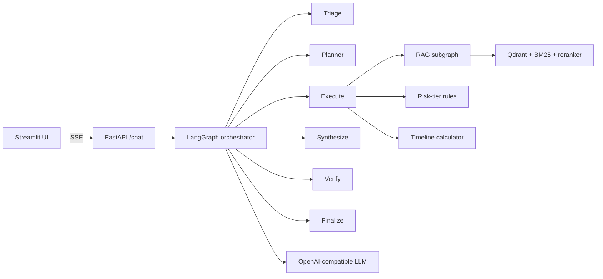

# EU AI Act Copilot

An agentic RAG assistant for first-pass EU AI Act compliance work. It answers
questions with article-level citations, routes risk classification and deadline
work to deterministic tools, and streams the agent trace through FastAPI and
Streamlit.

> **Status: Phase 7 delivery polish.** Phases 0–6 are implemented: ingestion,
> hybrid RAG, deterministic tools, the six-node LangGraph orchestrator,
> streaming API/UI, evaluation harness, and Locust load-test instrumentation.
> Real GPU measurements, a populated production corpus, and measured ablation
> reports still require the inference machine.

This is decision support, not legal advice. A human must verify the cited
regulation and apply organisation-specific facts before relying on an output.

## Architecture



The orchestrator has bounded conditional routes: refusal goes directly to
finalization, direct questions skip planning, composite questions are
decomposed into dependent subtasks, and failed verification gets at most one
retrieval retry. The RAG subgraph is independently testable and combines dense
Qdrant retrieval, BM25, reciprocal-rank fusion, optional cross-encoder
reranking, grading, and structure-aware compression.

The risk-tier tool and compliance timeline are pure Python after structured
feature extraction. This keeps the regulatory decision and date arithmetic
reproducible and auditable instead of asking the LLM to guess them.

## Quickstart

Requirements: Python 3.11+, `uv`, Docker Compose, and (for the GPU profile)
the NVIDIA Container Toolkit or Docker Desktop GPU passthrough.

```bash
cp .env.example .env
make up
```

The dummy profile needs no model or GPU. Open <http://localhost:8501> for the
UI or <http://localhost:8000/health> for the API.

For a real model, set `LLM_PROVIDER=openai_compatible` in `.env`, then use one
of these profiles:

```bash
make up-gpu       # vLLM + Qwen3-8B-FP8; NVIDIA GPU required
make up-cpu       # llama.cpp + Qwen2.5-1.5B; CPU-only fallback
```

Populate the corpus after Qdrant is running:

```bash
docker compose up -d qdrant
make build
make ingest
```

The ingestion job fetches the pinned public sources, parses their hierarchy,
builds structure-aware chunks, embeds them, upserts Qdrant, and writes
`data/manifest.json`. Raw sources are intentionally not committed.

## Development and evaluation

```bash
uv sync --locked
make check             # ruff + mypy + pytest
make eval              # isolated retrieval metrics; indexed corpus required
make eval-generate     # persist all 20 end-to-end outputs
make eval-judge        # score the latest generation without rerunning it
```

The end-to-end set covers six factual, four composite, four tool-required,
three negative/refusal, and three unanswerable cases. Generation artifacts are
JSON; the default judge reports route accuracy, refusal/abstention signals,
required/forbidden content, citation resolvability, tool exact match, and
latency. The dummy model is useful for graph smoke tests, not for quality
claims.

## Load testing

Run the load generator from a client machine, not the GPU box running the
stack:

```bash
LOADTEST_HOST=http://gpu-box:8000 make load
make metrics
make report
```

On PowerShell, set the host with
`$env:LOADTEST_HOST='http://gpu-box:8000'` before `make load`.

Locust samples the 20 evaluation questions, keeps a session per virtual user,
and streams `/chat` to completion. It writes request CSV files, per-node
timings in `loadtest/reports/node_timings.jsonl`, and telemetry snapshots from
the API, vLLM `/metrics`, and `nvidia-smi`. Use `LOADTEST_CASES`,
`LOADTEST_TOP_K`, and `LOADTEST_RERANK_ENABLED` for focused or ablation runs.

The inference-only baseline is separate:

```bash
make up-gpu
make bench
```

This measures the serving ceiling before application overhead is introduced.

## API contract

- `GET /health` returns process status, provider/model identity, dependency
  reachability, git SHA, and the corpus manifest when ingestion has completed.
- `POST /chat` accepts `message`, optional `session_id`, `top_k`, and
  `rerank_enabled`; it returns an SSE stream containing `session`, `node`,
  `token`, `done`, or `error` events.

The same application image works with the dummy provider, local vLLM,
llama.cpp, or a remote OpenAI-compatible endpoint selected through `.env`.

## Repository layout

```text
src/copilot/       application, ingestion, RAG, tools, agent, API, UI
data/eval/         retrieval gold set and 20-case end-to-end QA set
evals/             retrieval evaluator, generation runner, deterministic judge
loadtest/          Locust client, telemetry collector, report renderer
tests/             unit and graph/API integration tests
deploy/            vLLM and WSL2 configuration templates
PLAN.md            design rationale, phase plan, and measurement methodology
```

## Reproducibility and limitations

Dependencies are locked in `uv.lock`; CI runs with `LLM_PROVIDER=dummy` and
validates linting, typing, tests, Docker build, and all Compose profiles. The
GPU profile is deliberately not fully pinned until the target Blackwell
driver/CUDA combination is verified on the inference box; `deploy/vllm.env`
records the serving knobs in one place.

The current deployment uses in-process session memory and a development
checkpointer. For production, the next changes are a persistent checkpointer,
authentication, PII handling, corpus versioning, a human-review queue, and
scaling Qdrant/inference beyond the single-box demo topology. No performance
or legal-quality number should be inferred until the real corpus and GPU load
runs have been recorded in the report artifacts.
